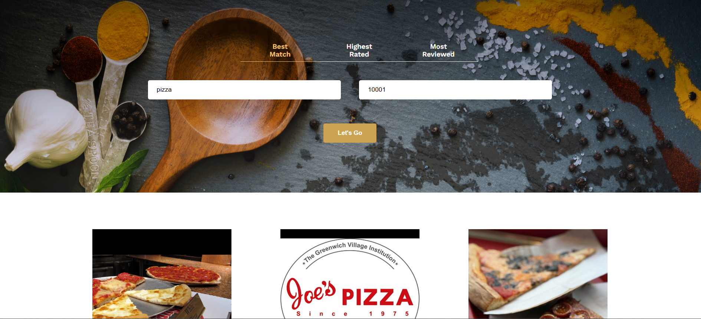

# Ravenous (Yelp Search) – React + Yelp Fusion API

A React app that searches Yelp businesses by **term**, **location**, and **sort order**, then displays results in a clean card layout.

## Features

- Search businesses by term + location
- Sort results (Best Match / Highest Rated / Most Reviewed)
- Displays business info (name, address, category, rating, reviews, image)
- API key stored safely in `.env` (not committed)

## Tech Stack

- React
- JavaScript (ES6)
- Yelp Fusion API
- CSS

## Getting Started

### 1) Install dependencies

```bash
npm install
```

## Screenshot


